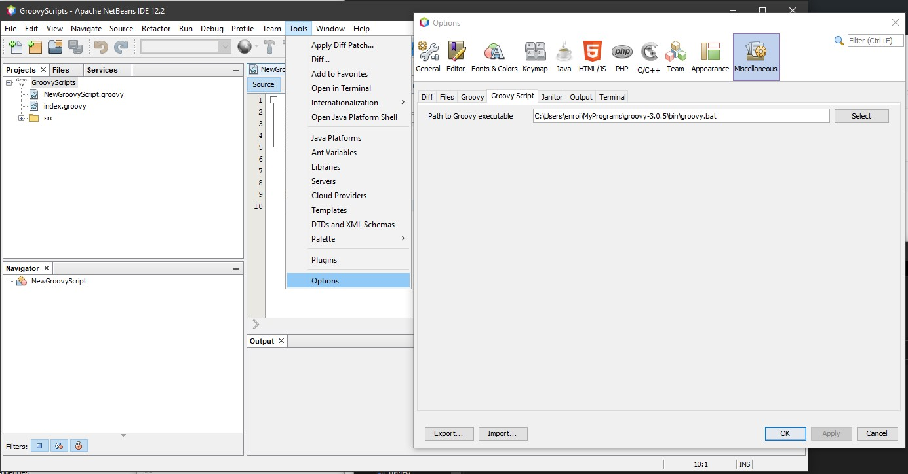
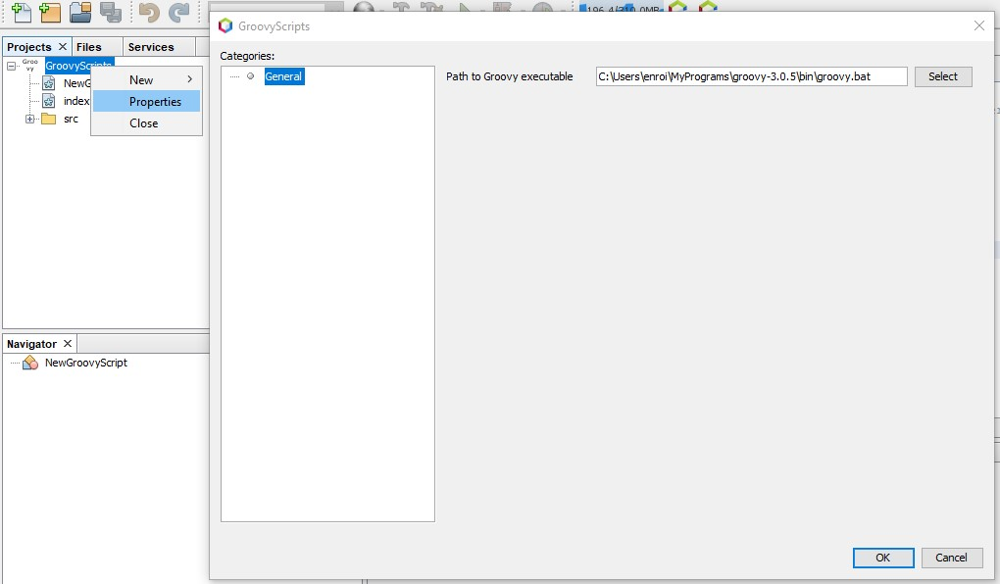
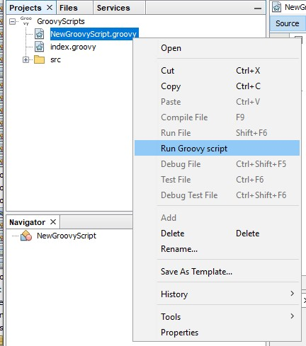
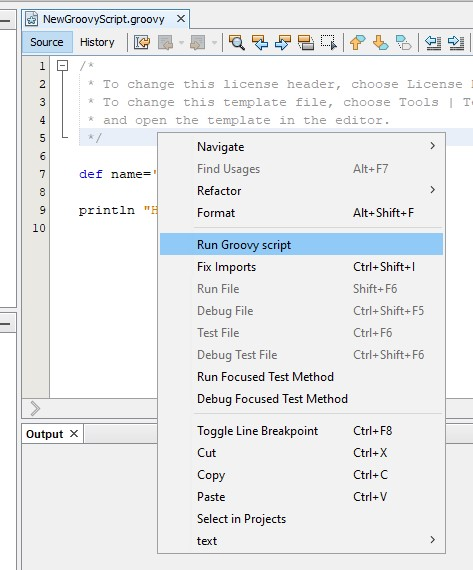
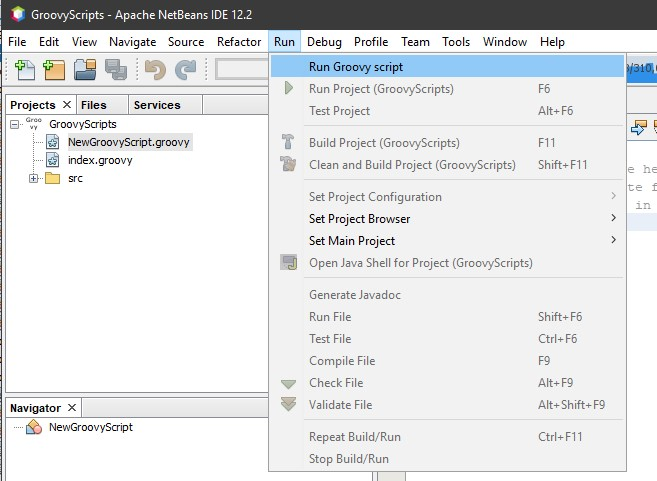

# GroovyScripts
## Description
It is NetBeans module for start Groovy scripts with Groovy executable.
## Configuration
For execute Groovy scripts with external Groovy executable path to Groovy executable should be set. 
There are 2 ways for configuration path to Groovy executable
### Global
Path to Groovy executable can be set for all "Groovy Scripts" projects in menu item "Tools"-"Options" tab "Miscellaneous" subtab "Groovy Script"

### For project
Path to Groovy executable can be set for "Groovy Script" project in project properties. 

### Run Groovy script
Groovy script can be started in such ways:
1. Click mouse right button to Groovy script in project tab and select "Run Groovy script" item.
2. Click mouse right button in editor and select "Run Groovy script"
3. Open Groovy script for edit and select menu item "Run"-"Run Groovy script"

